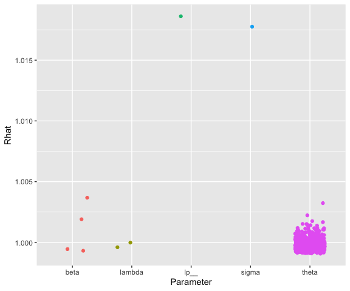
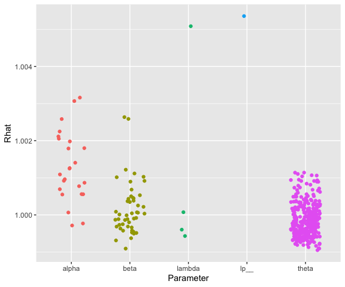

A brief manual
================
Daniel C. Furr

# Overview

The edstan package for R provides convenience functions and predefined
Stan models related to item response theory (IRT). Its purpose is to
make fitting common IRT models using Stan easy. edstan relies on the
rstan package, which should be installed first. [See
here](https://github.com/stan-dev/rstan/wiki/RStan-Getting-Started) for
instructions on installing rstan.

The following table lists the models packaged with edstan. Each of these
may optionally included a latent regression of ability. The table
includes also links to case studies for the models, though it should be
noted that the Stan code and prior distributions have changed somewhat
this they were written.

| Model | Stan file |
|----|----|
| [Rasch](https://mc-stan.org/learn-stan/case-studies/rasch_and_2pl.html) | *rasch_latent_reg.stan* |
| [Partial credit](https://mc-stan.org/learn-stan/case-studies/pcm_and_gpcm.html) | *pcm_latent_reg.stan* |
| [Rating scale](https://mc-stan.org/learn-stan/case-studies/rsm_and_grsm.html) | *rsm_latent_reg.stan* |
| [Two-parameter logistic](https://mc-stan.org/learn-stan/case-studies/rasch_and_2pl.html) | *2pl_latent_reg.stan* |
| [Generalized partial credit](https://mc-stan.org/learn-stan/case-studies/pcm_and_gpcm.html) | *gpcm_latent_reg.stan* |
| [Generalized rating scale](https://mc-stan.org/learn-stan/case-studies/rsm_and_grsm.html) | *grsm_latent_reg.stan* |

The next table lists the functions packaged with edstan.

| Function               | Purpose                                          |
|------------------------|--------------------------------------------------|
| `irt_data()`           | Prepares data for fitting                        |
| `irt_stan()`           | Wrapper for Running MCMC                         |
| `print_irt_stan()`     | Show table of output                             |
| `stan_columns_plot()`  | Create plot of convergence statistics            |
| `labelled_integer()`   | Create vector of consecutive integers            |
| `rescale_binary()`     | Appropriately scale binary person covariates     |
| `rescale_continuous()` | Appropriately scale continuous person covariates |
| `edstan_model_code()`  | Print the Stan file for a given model            |

# Brief tutorial

## Dichotomous IRT with spelling data

The R code below first loads edstan, which implicitly loads rstan. Then
the two commands that follow set options related to rstan, which are
generally recommended. The first causes compiled Stan models to be saved
to disc, which allows models to run more quickly after the first time.
The second causes Stan to run multiple MCMC chains in parallel.

``` r
# Load packages and set options
library(edstan)
options(mc.cores = parallel::detectCores())
```

Next we preview the spelling data set.

``` r
# Preview the spelling data
spelling[sample(1:nrow(spelling), 6), ]
```

    ##     male infidelity panoramic succumb girder
    ## 108    1          0         1       0      1
    ## 495    1          1         1       0      1
    ## 247    0          1         0       0      1
    ## 423    0          1         1       0      1
    ## 150    0          1         0       0      0
    ## 431    0          1         1       0      1

The data set is a response matrix indicating whether the 658 respondents
spelled four words correctly. It also includes a dummy variable for
whether the respondent is male. Data is fed into Stan in list form, and
the next block of code demonstrates how a suitable data list may be
constructed using the `irt_data()` function. The response matrix (that
is, all columns but the first) is provided as the `response_matrix`
option.

``` r
# Make a data list
simple_list <- irt_data(response_matrix = spelling[, -1])
str(simple_list)
```

    ## List of 8
    ##  $ N : int 2632
    ##  $ I : int 4
    ##  $ J : int 658
    ##  $ ii: Named int [1:2632] 1 2 3 4 1 2 3 4 1 2 ...
    ##   ..- attr(*, "names")= chr [1:2632] "infidelity" "panoramic" "succumb" "girder" ...
    ##  $ jj: Named int [1:2632] 1 1 1 1 2 2 2 2 3 3 ...
    ##   ..- attr(*, "names")= chr [1:2632] "1" "1" "1" "1" ...
    ##  $ y : int [1:2632] 0 0 0 0 0 0 0 0 0 0 ...
    ##  $ K : int 1
    ##  $ W : num [1:658, 1] 1 1 1 1 1 1 1 1 1 1 ...
    ##   ..- attr(*, "dimnames")=List of 2
    ##   .. ..$ : chr [1:658] "1" "2" "3" "4" ...
    ##   .. ..$ : chr "(Intercept)"
    ##   ..- attr(*, "assign")= int 0

This data list may be fed to the `irt_stan()` function to fit a Rasch or
2PL model, but for this example we will add a person covariate to the
model using the optional arguments *covariates* and *formula*. The
*covariates* option takes a data frame of person-related covariates and
the *formula* option takes a formula to be applied to that data frame.
The left side of the formula should be left empty, though implicitly it
is latent ability. The choice of what to include in the latent
regression (if anything) is made when calling `irt_data()` to assemble a
data list.

In the next block a data list is made that includes `male` as a
covariate. We use the `rescale_binary()` function to rescale this
covariate for compatibility with the prior distributions specified in
edstan models.

``` r
# Make a data list with person covariates
latent_reg_list <- irt_data(
  response_matrix = spelling[, -1],
  covariates = spelling,
  formula = ~ rescale_binary(male)
)

str(latent_reg_list)
```

    ## List of 8
    ##  $ N : int 2632
    ##  $ I : int 4
    ##  $ J : int 658
    ##  $ ii: Named int [1:2632] 1 2 3 4 1 2 3 4 1 2 ...
    ##   ..- attr(*, "names")= chr [1:2632] "infidelity" "panoramic" "succumb" "girder" ...
    ##  $ jj: Named int [1:2632] 1 1 1 1 2 2 2 2 3 3 ...
    ##   ..- attr(*, "names")= chr [1:2632] "1" "1" "1" "1" ...
    ##  $ y : int [1:2632] 0 0 0 0 0 0 0 0 0 0 ...
    ##  $ K : int 2
    ##  $ W : num [1:658, 1:2] 1 1 1 1 1 1 1 1 1 1 ...
    ##   ..- attr(*, "dimnames")=List of 2
    ##   .. ..$ : chr [1:658] "1" "2" "3" "4" ...
    ##   .. ..$ : chr [1:2] "(Intercept)" "rescale_binary(male)"
    ##   ..- attr(*, "assign")= int [1:2] 0 1

The only difference between the two lists are `K` and `W`. The first
list has `W` with $K=1$ columns, which is a constant for the model
intercept. The second list has `W` with $K=2$ columns, which correspond
to the constant for the model intercept and the male indicator variable.
In either list, `W` has one row per person.

Next we fit the model using the `irt_stan()` function, which is a
wrapper for `rstan::stan()`. `latent_reg_list` is provided as the data,
and the name of one of the *.stan* files to use is provided as the
*model* argument. We also choose the number of chains and number of
iterations per chain. By default the first half of each chain is
discarded as warm up.

``` r
# Fit the Rasch model
fit_rasch <- irt_stan(latent_reg_list, model = "rasch_latent_reg.stan",
                      iter = 2000, chains = 4)
```

The `stan_columns_plot()` function shows convergence statistics for the
fitted model. As an aside, it may also be used to show other statistics
such as posterior means or numbers of effective samples.

``` r
# View convergence statistics
stan_columns_plot(fit_rasch)
```

<!-- -->

`print_irt_stan()` provides a summary of parameter posteriors. It is a
wrapper for the `print()` method for fitted Stan models, selecting and
organizing the most interesting parameters. Labels for the items are
automatically taken from the column names of the response matrix.
Regarding the parameters in the output: *beta* refers to item
difficulties, *lambda* refers to latent regression coefficients, and
*sigma* is the standard deviation of the ability distribution.

``` r
# View a summary of parameter posteriors                      
print_irt_stan(fit_rasch, latent_reg_list)
```

    ## Inference for Stan model: anon_model.
    ## 4 chains, each with iter=2000; warmup=1000; thin=1; 
    ## post-warmup draws per chain=1000, total post-warmup draws=4000.
    ##   
    ##              mean se_mean   sd  2.5%   25%   50%   75% 97.5% n_eff Rhat
    ## Item 1: infidelity
    ##   beta[1]   -1.34       0 0.10 -1.54 -1.40 -1.34 -1.28 -1.16  2014 1.00
    ## Item 2: panoramic
    ##   beta[2]   -0.30       0 0.08 -0.47 -0.36 -0.31 -0.25 -0.14  6289 1.00
    ## Item 3: succumb
    ##   beta[3]    1.44       0 0.09  1.28  1.38  1.44  1.50  1.62  1743 1.00
    ## Item 4: girder
    ##   beta[4]    0.20       0 0.08  0.05  0.15  0.20  0.25  0.35  4487 1.00
    ## Ability distribution
    ##   lambda[1]  0.36       0 0.07  0.23  0.31  0.36  0.41  0.49  2261 1.00
    ##   lambda[2]  0.24       0 0.14 -0.02  0.15  0.24  0.33  0.52  2614 1.00
    ##   sigma      1.25       0 0.09  1.07  1.18  1.25  1.31  1.44   463 1.02
    ##   
    ## Samples were drawn using NUTS(diag_e) at Mon Mar 24 12:12:58 2025.
    ## For each parameter, n_eff is a crude measure of effective sample size,
    ## and Rhat is the potential scale reduction factor on split chains (at 
    ## convergence, Rhat=1).

A convenient way to view the Stan code for the model is the
`edstan_model_code()` function.

``` r
edstan_model_code("rasch_latent_reg.stan")
```

    ## data {
    ##   int<lower=1> I; // # questions
    ##   int<lower=1> J; // # persons
    ##   int<lower=1> N; // # observations
    ##   array[N] int<lower=1, upper=I> ii; // question for n
    ##   array[N] int<lower=1, upper=J> jj; // person for n
    ##   array[N] int<lower=0, upper=1> y; // correctness for n
    ##   int<lower=1> K; // # person covariates
    ##   matrix[J, K] W; // person covariate matrix
    ## }
    ## parameters {
    ##   sum_to_zero_vector[I] beta;
    ##   vector[J] theta;
    ##   real<lower=0> sigma;
    ##   vector[K] lambda;
    ## }
    ## model {
    ##   beta ~ normal(0, 3);
    ##   theta ~ normal(W * lambda, sigma);
    ##   lambda ~ student_t(7, 0, 2.5);
    ##   sigma ~ gamma(2, 1);
    ##   y ~ bernoulli_logit(theta[jj] - beta[ii]);
    ## }

If we prefer to fit the 2PL model with latent regression, we could call
`irt_stan()` and select that *.stan* file.

``` r
# Fit the Rasch model
fit_rasch <- irt_stan(latent_reg_list, model = "2pl_latent_reg.stan",
                      iter = 2000, chains = 4)
```

## Polytomous IRT with verbal aggression data

The second example will use the verbal aggression data to fit a
polytomous item response theory model.

``` r
# Preview the data
head(aggression)
```

    ##   person item poly dich    description anger male do other scold shout
    ## 1      1    1    0    0   do bus curse    20    1  0     1     0     0
    ## 2      1    2    0    0   do bus scold    20    1  0     1     1     0
    ## 3      1    3    0    0   do bus shout    20    1  0     1     0     1
    ## 4      1    4    0    0 do train curse    20    1  0     1     0     0
    ## 5      1    5    0    0 do train scold    20    1  0     1     1     0
    ## 6      1    6    0    0 do train shout    20    1  0     1     0     1

The data consists of 316 persons responding to 24 items with responses
scored as 0, 1, or 2. The variable `person` is a person ID, `item` is an
item ID, and `poly` is the scored response. In this way, the data may be
said to be in “long form” as there is one row per person-item
combination. The data includes two person covariates: `male` is a dummy
variable for whether the respondent is male, and `anger` is the person’s
trait anger raw score, a separate measure.

Next we make the data list using `irt_data()`. However, we’ll use a
different set of arguments because the data are in long form: `y` takes
the responses in vector form, `ii` takes a vector of item IDs, and `jj`
takes a vector of person IDs. The use of *covariates* and *formula* are
the same as before. For the latent regression part, we use the
`rescale_binary()` and `rescale_continuous()` functions to rescale the
covariates for compatibility with the prior distributions specified in
edstan models.

``` r
# Make the data list
agg_list <- irt_data(
  y = aggression$poly,
  ii = aggression$description,
  jj = aggression$person,
  covariates = aggression,
  formula = ~ rescale_binary(male) * rescale_continuous(anger)
)

str(agg_list)
```

    ## List of 8
    ##  $ N : int 7584
    ##  $ I : int 24
    ##  $ J : int 316
    ##  $ ii: Named int [1:7584] 1 2 3 4 5 6 7 8 9 10 ...
    ##   ..- attr(*, "names")= chr [1:7584] "do bus curse" "do bus scold" "do bus shout" "do train curse" ...
    ##  $ jj: Named int [1:7584] 1 1 1 1 1 1 1 1 1 1 ...
    ##   ..- attr(*, "names")= chr [1:7584] "1" "1" "1" "1" ...
    ##  $ y : int [1:7584] 0 0 0 0 0 0 0 0 1 2 ...
    ##  $ K : int 4
    ##  $ W : num [1:316, 1:4] 1 1 1 1 1 1 1 1 1 1 ...
    ##   ..- attr(*, "dimnames")=List of 2
    ##   .. ..$ : chr [1:316] "1" "25" "49" "73" ...
    ##   .. ..$ : chr [1:4] "(Intercept)" "rescale_binary(male)" "rescale_continuous(anger)" "rescale_binary(male):rescale_continuous(anger)"
    ##   ..- attr(*, "assign")= int [1:4] 0 1 2 3

The generalized partial credit model is fit to the these data.

``` r
# Fit the generalized partial credit model
fit_gpcm <- irt_stan(agg_list, model = "gpcm_latent_reg.stan",
                     iter = 2000, chains = 4)
```

As before, a plot of convergence statistics is made.

``` r
# View convergence statistics
stan_columns_plot(fit_gpcm)
```

<!-- -->

And lastly we obtain a table of posterior summaries. Here, *alpha*
refers to discrimination parameters, *beta* refers to step difficulty
parameters, and *lambda* refers to latent regression coefficients.

``` r
# View a summary of parameter posteriors    
print_irt_stan(fit_gpcm, agg_list)
```

    ## Inference for Stan model: anon_model.
    ## 4 chains, each with iter=2000; warmup=1000; thin=1; 
    ## post-warmup draws per chain=1000, total post-warmup draws=4000.
    ##   
    ##              mean se_mean   sd  2.5%   25%   50%   75% 97.5% n_eff Rhat
    ## Item 1: do bus curse
    ##   alpha[1]   0.75    0.00 0.12  0.53  0.67  0.75  0.83  1.00  1647 1.00
    ##   beta[1]   -0.95    0.00 0.22 -1.38 -1.09 -0.94 -0.80 -0.54  2557 1.00
    ##   beta[2]   -0.79    0.00 0.15 -1.08 -0.89 -0.79 -0.69 -0.49  5773 1.00
    ## Item 2: do bus scold
    ##   alpha[2]   0.98    0.00 0.14  0.73  0.88  0.97  1.07  1.27  1418 1.00
    ##   beta[3]   -0.70    0.00 0.22 -1.15 -0.85 -0.70 -0.55 -0.29  2591 1.00
    ##   beta[4]   -0.66    0.00 0.16 -0.97 -0.76 -0.66 -0.55 -0.34  6642 1.00
    ## Item 3: do bus shout
    ##   alpha[3]   0.81    0.00 0.13  0.57  0.72  0.80  0.89  1.07  2271 1.00
    ##   beta[5]   -0.34    0.00 0.18 -0.71 -0.46 -0.33 -0.22  0.02  3204 1.00
    ##   beta[6]    0.15    0.00 0.17 -0.17  0.04  0.15  0.26  0.49  7104 1.00
    ## Item 4: do train curse
    ##   alpha[4]   0.84    0.00 0.13  0.61  0.75  0.83  0.92  1.10  1828 1.00
    ##   beta[7]   -1.61    0.00 0.24 -2.08 -1.77 -1.59 -1.44 -1.14  2699 1.00
    ##   beta[8]   -0.76    0.00 0.15 -1.06 -0.86 -0.76 -0.66 -0.48  4676 1.00
    ## Item 5: do train scold
    ##   alpha[5]   0.90    0.00 0.13  0.66  0.81  0.89  0.98  1.16  1723 1.00
    ##   beta[9]   -0.77    0.00 0.21 -1.19 -0.90 -0.76 -0.63 -0.38  2873 1.00
    ##   beta[10]  -0.58    0.00 0.15 -0.89 -0.68 -0.58 -0.47 -0.28  5804 1.00
    ## Item 6: do train shout
    ##   alpha[6]   0.85    0.00 0.13  0.61  0.76  0.84  0.94  1.13  2173 1.00
    ##   beta[11]  -0.20    0.00 0.19 -0.58 -0.33 -0.20 -0.08  0.16  3147 1.00
    ##   beta[12]  -0.20    0.00 0.16 -0.53 -0.30 -0.19 -0.09  0.13  6431 1.00
    ## Item 7: do store curse
    ##   alpha[7]   0.64    0.00 0.11  0.43  0.56  0.63  0.71  0.86  2497 1.00
    ##   beta[13]  -0.58    0.00 0.18 -0.94 -0.69 -0.57 -0.45 -0.23  3571 1.00
    ##   beta[14]   0.27    0.00 0.16 -0.05  0.16  0.27  0.37  0.59  6035 1.00
    ## Item 8: do store scold
    ##   alpha[8]   1.00    0.00 0.15  0.71  0.89  0.99  1.09  1.33  1887 1.00
    ##   beta[15]  -0.01    0.00 0.18 -0.36 -0.13 -0.02  0.11  0.32  3297 1.00
    ##   beta[16]   1.08    0.00 0.23  0.64  0.92  1.07  1.23  1.55  4577 1.00
    ## Item 9: do store shout
    ##   alpha[9]   0.84    0.00 0.16  0.56  0.73  0.83  0.94  1.17  2909 1.00
    ##   beta[17]   0.76    0.00 0.17  0.41  0.64  0.76  0.88  1.10  3884 1.00
    ##   beta[18]   1.62    0.01 0.32  1.03  1.40  1.61  1.83  2.28  3839 1.00
    ## Item 10: do operator curse
    ##   alpha[10]  0.72    0.00 0.11  0.51  0.65  0.72  0.80  0.96  2013 1.00
    ##   beta[19]  -1.07    0.00 0.20 -1.47 -1.20 -1.06 -0.93 -0.70  3106 1.00
    ##   beta[20]  -0.06    0.00 0.15 -0.35 -0.16 -0.06  0.03  0.22  5523 1.00
    ## Item 11: do operator scold
    ##   alpha[11]  1.09    0.00 0.16  0.78  0.98  1.08  1.20  1.43  1812 1.00
    ##   beta[21]  -0.26    0.00 0.19 -0.63 -0.38 -0.25 -0.12  0.12  2593 1.00
    ##   beta[22]   0.37    0.00 0.19  0.01  0.25  0.37  0.50  0.73  5772 1.00
    ## Item 12: do operator shout
    ##   alpha[12]  0.68    0.00 0.12  0.45  0.59  0.67  0.75  0.93  2871 1.00
    ##   beta[23]   0.68    0.00 0.17  0.35  0.56  0.68  0.79  1.01  3969 1.00
    ##   beta[24]   0.45    0.00 0.22  0.04  0.31  0.45  0.59  0.87  5361 1.00
    ## Item 13: want bus curse
    ##   alpha[13]  1.17    0.00 0.16  0.88  1.06  1.16  1.27  1.50  1517 1.00
    ##   beta[25]  -1.65    0.01 0.26 -2.19 -1.82 -1.64 -1.47 -1.16  2628 1.00
    ##   beta[26]  -0.72    0.00 0.15 -1.02 -0.82 -0.72 -0.62 -0.43  4271 1.00
    ## Item 14: want bus scold
    ##   alpha[14]  1.55    0.01 0.21  1.16  1.40  1.53  1.68  1.98  1608 1.00
    ##   beta[27]  -1.31    0.01 0.27 -1.87 -1.49 -1.31 -1.13 -0.81  2728 1.00
    ##   beta[28]  -0.35    0.00 0.18 -0.70 -0.47 -0.35 -0.23 -0.01  5089 1.00
    ## Item 15: want bus shout
    ##   alpha[15]  0.91    0.00 0.14  0.66  0.81  0.90  1.00  1.22  2321 1.00
    ##   beta[29]   0.38    0.00 0.18  0.02  0.26  0.38  0.50  0.72  2777 1.00
    ##   beta[30]   0.39    0.00 0.20 -0.01  0.25  0.39  0.53  0.80  4744 1.00
    ## Item 16: want train curse
    ##   alpha[16]  1.16    0.00 0.16  0.87  1.05  1.16  1.27  1.50  1260 1.00
    ##   beta[31]  -1.26    0.00 0.24 -1.75 -1.42 -1.26 -1.10 -0.81  2493 1.00
    ##   beta[32]  -0.70    0.00 0.16 -1.02 -0.82 -0.70 -0.59 -0.39  5331 1.00
    ## Item 17: want train scold
    ##   alpha[17]  1.53    0.01 0.22  1.14  1.37  1.51  1.66  1.99  1312 1.00
    ##   beta[33]  -0.89    0.00 0.24 -1.37 -1.05 -0.88 -0.72 -0.43  2392 1.00
    ##   beta[34]   0.08    0.00 0.18 -0.27 -0.04  0.08  0.20  0.43  5459 1.00
    ## Item 18: want train shout
    ##   alpha[18]  1.17    0.00 0.19  0.82  1.03  1.16  1.29  1.56  2559 1.00
    ##   beta[35]   0.71    0.00 0.19  0.33  0.58  0.71  0.84  1.08  2928 1.00
    ##   beta[36]   0.84    0.00 0.27  0.34  0.66  0.83  1.02  1.40  4400 1.00
    ## Item 19: want store curse
    ##   alpha[19]  0.88    0.00 0.14  0.63  0.78  0.87  0.96  1.16  2170 1.00
    ##   beta[37]  -0.32    0.00 0.18 -0.66 -0.44 -0.32 -0.20  0.03  3182 1.00
    ##   beta[38]   0.88    0.00 0.20  0.50  0.74  0.88  1.01  1.28  5445 1.00
    ## Item 20: want store scold
    ##   alpha[20]  1.21    0.00 0.20  0.85  1.07  1.20  1.33  1.62  2417 1.00
    ##   beta[39]   0.58    0.00 0.19  0.20  0.45  0.58  0.71  0.94  3244 1.00
    ##   beta[40]   1.56    0.01 0.32  0.96  1.34  1.55  1.77  2.23  4071 1.00
    ## Item 21: want store shout
    ##   alpha[21]  0.94    0.00 0.21  0.57  0.80  0.93  1.07  1.39  3414 1.00
    ##   beta[41]   1.98    0.00 0.22  1.56  1.83  1.97  2.12  2.41  4160 1.00
    ##   beta[42]   2.32    0.01 0.62  1.21  1.88  2.28  2.72  3.62  2904 1.00
    ## Item 22: want operator curse
    ##   alpha[22]  0.92    0.00 0.13  0.68  0.83  0.92  1.01  1.20  1821 1.00
    ##   beta[43]  -1.00    0.00 0.20 -1.41 -1.13 -0.99 -0.86 -0.61  2884 1.00
    ##   beta[44]  -0.04    0.00 0.16 -0.35 -0.15 -0.04  0.06  0.26  5342 1.00
    ## Item 23: want operator scold
    ##   alpha[23]  1.19    0.00 0.17  0.87  1.07  1.18  1.30  1.55  1832 1.00
    ##   beta[45]  -0.35    0.00 0.20 -0.74 -0.48 -0.35 -0.22  0.03  2677 1.00
    ##   beta[46]   0.55    0.00 0.20  0.17  0.41  0.54  0.68  0.95  5351 1.00
    ## Item 24: want operator shout
    ##   alpha[24]  0.90    0.00 0.17  0.59  0.77  0.89  1.01  1.24  2781 1.00
    ##   beta[47]   1.23    0.00 0.19  0.85  1.10  1.23  1.35  1.61  3420 1.00
    ##   beta[48]   1.24    0.01 0.34  0.59  1.01  1.23  1.46  1.94  4320 1.00
    ## Ability distribution
    ##   lambda[1] -0.85    0.00 0.07 -1.00 -0.90 -0.85 -0.80 -0.71  1023 1.01
    ##   lambda[2]  0.33    0.00 0.14  0.05  0.23  0.33  0.42  0.61  4651 1.00
    ##   lambda[3]  0.60    0.00 0.12  0.36  0.52  0.60  0.68  0.85  4134 1.00
    ##   lambda[4] -0.28    0.00 0.27 -0.80 -0.46 -0.27 -0.09  0.25  4946 1.00
    ##   
    ## Samples were drawn using NUTS(diag_e) at Mon Mar 24 12:17:12 2025.
    ## For each parameter, n_eff is a crude measure of effective sample size,
    ## and Rhat is the potential scale reduction factor on split chains (at 
    ## convergence, Rhat=1).

# Technical notes

Users will be able to fit the edstan models without full knowledge of
the technical details, though these are provided in this section. All
that is really needed for interpreting results is to know the meanings
assigned to the Greek letters.

## Notation

Variables and parameters are similar across edstan models. The variables
used are:

- $i = 1 \ldots I$ indexes items.
- $j = 1 \ldots J$ indexes persons.
- $m_i$ is simultaneously the maximum score and the number of step
  difficulty parameters for item $i$ for partial credit models.
  Alternatively, $m$ is the same across all items for rating scale
  models.
- $s = 1 \ldots m_i$ or $s = 1 \ldots m$ indexes steps within items.
- $y_{ij}$ is the scored response of person $j$ to item $i$. The lowest
  score for items must be zero (except for rating scale models).
- $w_{j}$ is the vector of covariates for person $j$. $w_{j}$ may be
  assembled into a $J$-by-$K$ covariate matrix $W$, where $K$ is number
  of elements in $w_j$.

The parameters used are:

- For the Rasch and 2PL models, $\beta_i$ is the difficulty for item
  $i$. For the rating scale models, $\beta_i$ is the mean difficulty for
  item $i$. For partial credit models, $\beta_{is}$ is the difficulty
  for step $s$ of item $i$.
- $\kappa_s$ is a step difficulty for the (generalized) rating scale
  model.
- $\alpha_i$ is the discrimination parameter for item $i$ (when
  applicable).
- $\theta_j$ is the ability for person $j$.
- $\lambda$ is the vector of latent regression parameters of length $K$
  (when applicable).
- $\sigma$ is standard deviation for the ability distribution (when
  applicable).

The *.stan* files and the notation for the models below closely adhere
to these conventions.

## Rasch family models

### Rasch model

*rasch_latent_reg.stan*

$$ 
\mathrm{logit} [ \Pr(y_{ij} = 1 | \theta_j, \beta_i) ] = 
  \theta_j - \beta_i
$$

### Partial credit model

*pcm_latent_reg.stan*

$$
\Pr(Y_{ij} = y,~y > 0 | \theta_j, \beta_i) =
\frac{\exp \sum_{s=1}^y (\theta_j - \beta_{is})}
     {1 + \sum_{k=1}^{m_i} \exp \sum_{s=1}^k (\theta_j - \beta_{is})}
$$

$$
\Pr(Y_{ij} = y,~y = 0 | \theta_j, \beta_i) =
\frac{1}
     {1 + \sum_{k=1}^{m_i} \exp \sum_{s=1}^k (\theta_j - \beta_{is})}
$$

### Rating scale model

*rsm_latent_reg.stan*

$$
\Pr(Y_{ij} = y,~y > 0 | \theta_j, \beta_i, \kappa_s) =
\frac{\exp \sum_{s=1}^y (\theta_j - \beta_i - \kappa_s)}
     {1 + \sum_{k=1}^{m} \exp \sum_{s=1}^k (\theta_j - \beta_i - \kappa_s)}
$$

$$
\Pr(Y_{ij} = y,~y = 0 | \theta_j, \beta_i, \kappa_s) =
\frac{1}
     {1 + \sum_{k=1}^{m} \exp \sum_{s=1}^k (\theta_j - \beta_i - \kappa_s)}
$$

## Models featuring discrimination parameters

### Two-parameter logistic model

*2pl_latent_reg.stan*

$$
  \mathrm{logit} [ \Pr(y_{ij} = 1 | \alpha_i, \beta_i, \theta_j) ] =
  \alpha_i \theta_j - \beta_i
$$

### Generalized partial credit model

*gpcm_latent_reg.stan*

$$
\Pr(Y_{ij} = y,~y > 0 | \theta_j, \alpha_i, \beta_i) =
\frac{\exp \sum_{s=1}^y (\alpha_i  \theta_j - \beta_{is})}
     {1 + \sum_{k=1}^{m_i} \exp \sum_{s=1}^k 
       (\alpha_i \theta_j - \beta_{is})}
$$

$$
\Pr(Y_{ij} = y,~y = 0 | \theta_j, \alpha_i, \beta_i) =
\frac{1}
     {1 + \sum_{k=1}^{m_i} \exp \sum_{s=1}^k 
       (\alpha_i \theta_j + w_{j}' \lambda - \beta_{is})}
$$

### Generalized rating scale model

*grsm_latent_reg.stan*

$$
\Pr(Y_{ij} = y,~y > 0 | \theta_j, \lambda, \alpha_i, \beta_i, \kappa_s) =
\frac{\exp \sum_{s=1}^y 
       (\alpha_i \theta_j - \beta_i - \kappa_s)}
     {1 + \sum_{k=1}^{m} \exp \sum_{s=1}^k 
       (\alpha_i \theta_j - \beta_i - \kappa_s)}
$$

$$
\Pr(Y_{ij} = y,~y = 0 | \theta_j, \lambda, \alpha_i, \beta_i, \kappa_s) =
\frac{1}
     {1 + \sum_{k=1}^{m} \exp \sum_{s=1}^k 
       (\alpha_i \theta_j - \beta_i - \kappa_s)}
$$

## Priors

For Rasch family models, the prior distributions for the person-related
parameters are

- $\theta_j \sim \mathrm{N}(w_j' \lambda, \sigma^2)$
- $\lambda \sim t_7(0, 2.5)$
- $\sigma \sim \mathrm{gamma}(2, 1)$

For models with discrimination parameters, the priors are

- $\theta_j \sim \mathrm{N}(w_j' \lambda, 1)$
- $\lambda \sim t_7(0, 2.5)$

In either case, the prior for $\lambda$ is applied to centered and
scaled versions of the person covariates. Specifically: (1) continuous
covariates are mean-centered and then divided by two times their
standard deviations, (2) binary covariates are mean-centered and divided
their maximum minus minimum values, and (3) no change is made to the
constant, set to one, for the model intercept. $t_7$ is the Student’s
$t$ distribution with seven degrees of freedom.

The priors for the item parameters are

- $\alpha \sim \mathrm{lognormal}(.5, 1)$
- $\beta \sim \mathrm{N}(0, 9)$
- $\kappa \sim \mathrm{N}(0, 9)$

# Writing your own Stan models

It is expected that edstan users will eventually want to write their own
Stan models. In this case, the edstan functions may still be useful. If
the user-written models use the same conventions for naming variables
and parameters as the edstan models, then the `irt_data()` and
`print_irt_stan()` functions will work just fine for the user-written
models. The function `stan_columns_plot()` works with any Stan model,
and `labelled_integer()` may help in data preparation for Stan models in
general.
